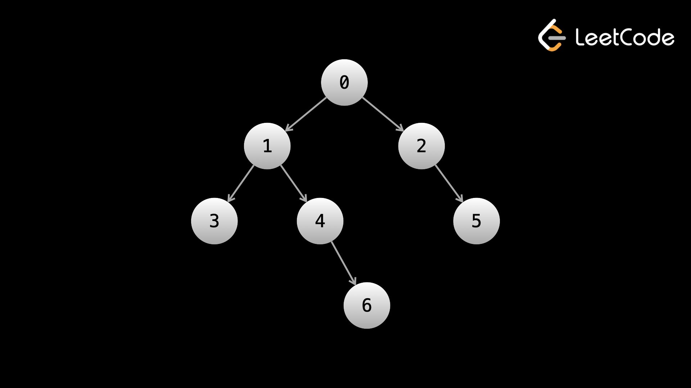

## Depth-first search (DFS)
>Recall that the depth of a node is its distance from the root.

 DFS is very similar across all problems. It goes as follows:
1. Handle the base case(s). Usually, an empty tree (`node = null`) is a base case.
2. Do some logic for the current node
3. Recursively call on the current node's children
4. Return the answer



### **Preorder traversal**
In preorder traversal, logic is done on the current node before moving to the children. Let's say that we wanted to just print the value of each node in the tree to the console. In that case, at any given node, we would print the current node's value, then recursively call the left child, then recursively call the right child.

```python
def preorder_dfs(node):
    if not node:
        return

    print(node.val)
    preorder_dfs(node.left)
    preorder_dfs(node.right)
    return
```

Running the above code on the example tree, we would see the nodes printed in this order: `0, 1, 3, 4, 6, 2, 5`.

### **Inorder traversal**
For inorder traversal, we first recursively call the left child, then perform logic (print in this case) on the current node, and then recursively call the right child. This means no logic will be done until we reach a node without a left child since calling on the left child takes priority over performing logic.

```python
def inorder_dfs(node):
    if not node:
        return

    inorder_dfs(node.left)
    print(node.val)
    inorder_dfs(node.right)
    return
```

Running the above code on the example tree, we would see the nodes printed in this order: `3, 1, 4, 6, 0, 2, 5`.

Notice that for any given node, its value is not printed until all values in the left subtree are printed, and values in its right subtree are not printed until after that.

### **Postorder traversal**

In postorder traversal, we recursively call on the children first and then perform logic on the current node. This means no logic will be done until we reach a leaf node since calling on the children takes priority over performing logic. In a postorder traversal, the root is the last node where logic is done.

```python 
def postorder_dfs(node):
    if not node:
        return

    postorder_dfs(node.left)
    postorder_dfs(node.right)
    print(node.val)
    return
```

Running the above code on the example tree, we would see the nodes printed in this order: `3, 6, 4, 1, 5, 2, 0`.

Notice that for any given node, no values in its right subtree are printed until all values in its left subtree are printed, and its own value is not printed until after that.

reference
https://leetcode.com/explore/interview/card/leetcodes-interview-crash-course-data-structures-and-algorithms/707/traversals-trees-graphs/4686/